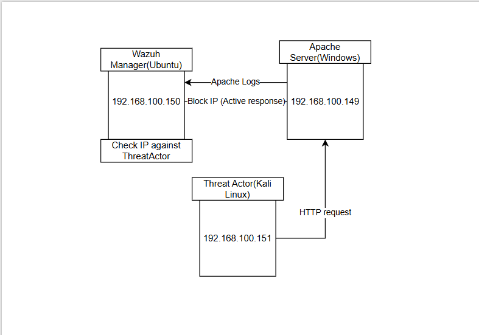
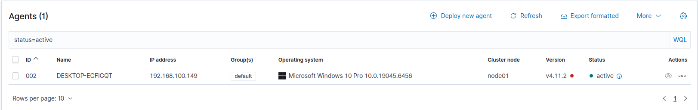
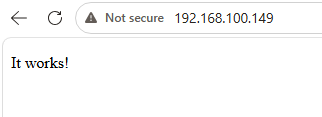
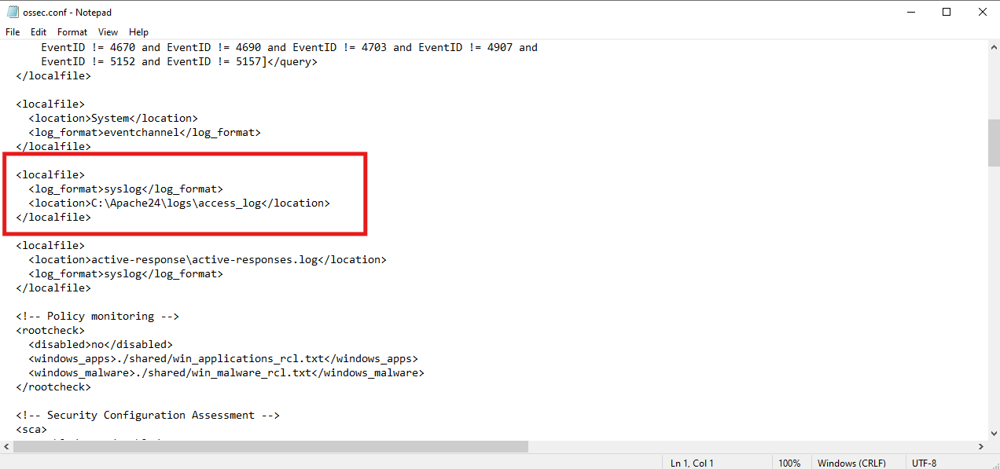
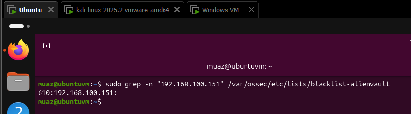
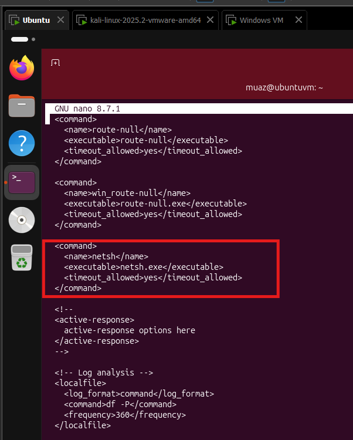
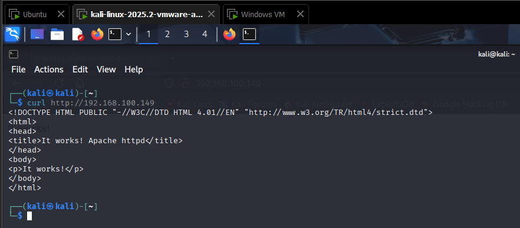
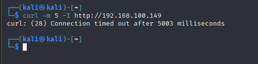
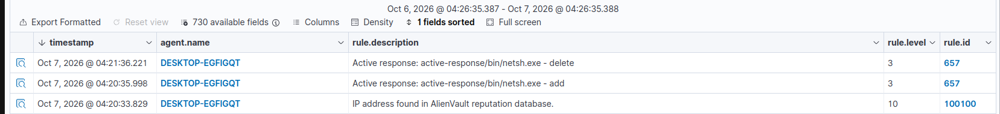

# Wazuh SIEM Home Lab: Automatically Blocking Known Threat Actors

I built a small SIEM lab where **Wazuh** watches a web server's logs and **automatically blocks** any visitor whose IP is on a threat-actor list. Kali Linux plays the attacker. When Kali tried to reach the web server, Wazuh recognised its IP and blocked it for 60 seconds.

> **Disclaimer:** For education only. Run this on a private lab network you own.

## How it works

```
Kali (attacker)  --->  Apache web server  --->  Wazuh agent  --->  Wazuh manager
                       (Windows VM)              (Windows VM)       (Ubuntu VM)
                                                       ^                  |
                                                       |   "block this IP" |
                                                       +-------------------+
```

1. Kali visits the web server on the Windows VM.
2. Apache writes the visit to its log, including Kali's IP address.
3. The Wazuh agent sends that log line to the manager.
4. The manager checks the IP against a list of known threat actors and finds a match, which triggers a custom alert.
5. The manager tells the agent to respond. The agent adds a Windows Firewall rule that blocks that IP.
6. After 60 seconds, the rule is removed automatically.

## Lab setup

| Machine | Role |
|---|---|
| Ubuntu VM | Wazuh manager, indexer and dashboard (the SIEM) |
| Windows VM | Apache web server and the Wazuh agent (the victim) |
| Kali Linux VM | The threat actor |

## What I did

1. **Set up Wazuh.** I installed the manager on Ubuntu and connected a Wazuh agent running on the Windows VM.
2. **Ran a web server.** I ran Apache on the Windows VM and confirmed it was reachable from the network.
3. **Collected the web server's logs.** I configured the agent to read Apache's access log and send it to the manager.
4. **Created a threat-actor list.** On the manager, I added the Kali IP to a reputation list of known bad IP addresses (the AlienVault list format).
5. **Wrote a detection rule.** A custom rule raises an alert whenever a visitor's IP is found in that list.
6. **Turned on active response.** I told Wazuh that when the rule fires, the Windows agent should block the IP using the built-in Windows firewall tool, and lift the block after 60 seconds.
7. **Tested it.** First I visited the web server from Kali before the IP was on the list (it worked). Then I added the IP and tried again (it was blocked).

## Results

- **Before:** Kali could open the web server normally.
- **After:** The visit triggered the alert "IP address found in AlienVault reputation database", then Wazuh blocked the IP.
- **After 60 seconds:** The block was removed automatically, and the dashboard shows the matching add and delete events.

### Screenshots


*The three machines and how they talk to each other.*


*The Windows agent shows as active in the Wazuh dashboard.*


*Apache running on the Windows VM.*


*Agent configured to collect the web server's logs.*


*The Kali IP added to the threat-actor list on the manager.*


*The custom rule and the active response settings (60-second block).*


*Before: Kali can reach the web server.*


*After: Kali's request times out.*


*Wazuh events showing the threat-list match, the block being added, and the block being removed.*

## Problems I ran into

| Problem | Fix |
|---|---|
| Couldn't write to the list file (permission denied) | The write has to run with admin rights, so I used a root-level write instead of a plain redirect |
| Apache wouldn't start on Windows | Its folder wasn't where the config expected, so I moved it to the default location |
| Two `ossec.conf` files on Windows | Only the one in the agent's install folder is live, so I edited that one |
| Wazuh and my WAF lab fought over port 443 | I ran only one of them at a time |


## Credits

Adapted from the Wazuh documentation's active response use case for blocking known malicious actors.

**Author:** [Your Name] | [LinkedIn / GitHub link]
