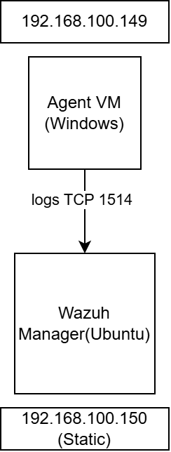
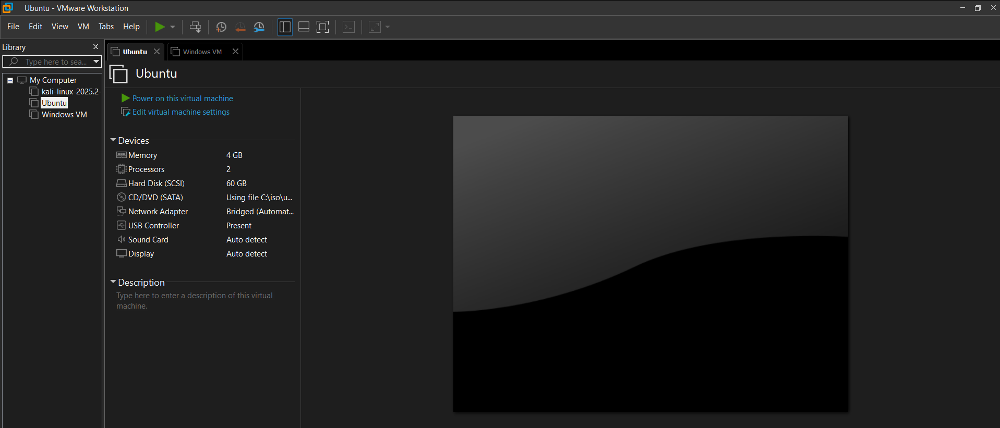
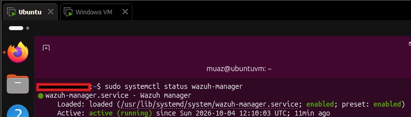
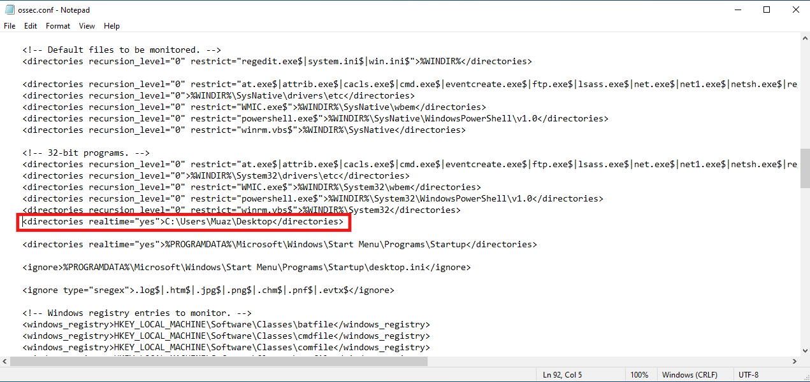
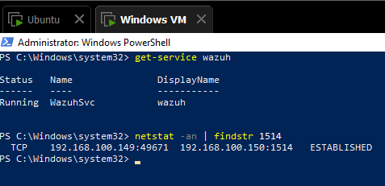
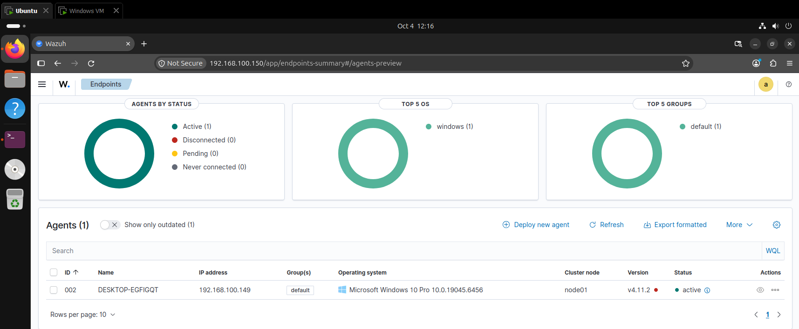
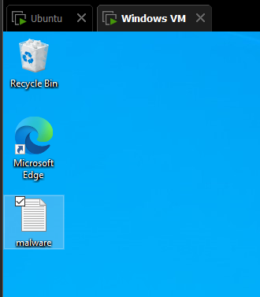
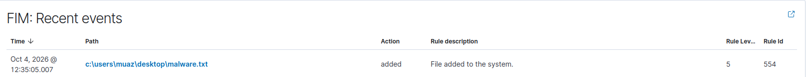
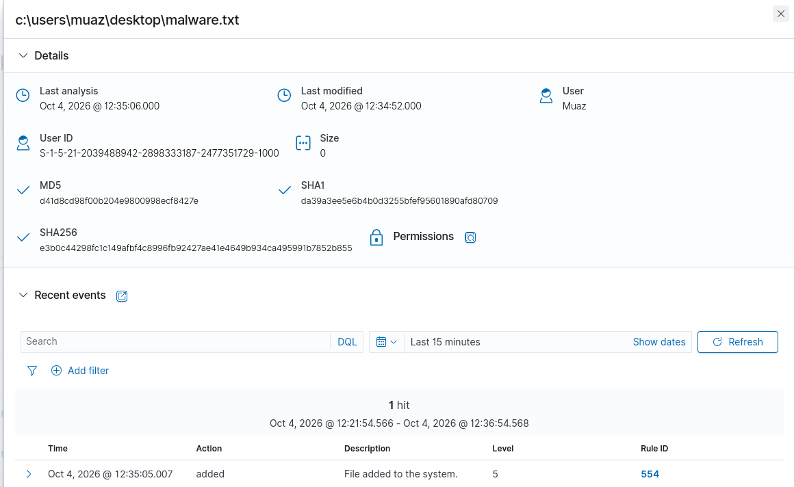

# SIEM Home Lab Wazuh

## Summary
I built a SIEM home lab using Wazuh. A Windows VM runs the Wazuh agent and sends logs to a Wazuh manager hosted on an Ubuntu VM. I configured the agent to monitor the Desktop, created a test file to generate a log, and analyzed the event in the Wazuh dashboard.

## Lab setup
| Wazuh manager | Receives and analyzes logs | Ubuntu 26.04.1 | 192.168.100.150 (static) |
| Wazuh agent | Collects and sends logs | Windows 10 | 192.168.100.149 |

- Virtualization: VMware
- Network: both VMs on a **bridged network** so they can reach each other easily
- Wazuh version: v4.12.0

## What I did

### 1. Built the lab
Created two virtual machines in VMware: an Ubuntu VM for the Wazuh manager and a Windows VM for the agent. Both use a bridged network.

### 2. Checked the manager is running
On the Ubuntu VM, I confirmed the Wazuh manager service is active.

### 3. Configured the agent
I edited the agent's configuration file (`ossec.conf`) so it monitors the Desktop for file changes (File Integrity Monitoring).

### 4. Checked agent connectivity
On the Windows VM, I confirmed the agent is connected to the manager.

### 5. Wazuh dashboard
The dashboard shows the agent registered and reporting to the manager.

### 6. Created a test file
I created a test file on the Desktop to trigger a log.

### 7. Log generation
Wazuh detected the change and generated a log.

### 8. Log analysis
I opened the log to analyze it. It shows details such as the **user name**, the **file name**, **file path**.

## What I learned
- How a SIEM collects logs from an endpoint using an agent.
- How to configure the agent through `ossec.conf` to choose what it monitors.
- File Integrity Monitoring tracks files, not empty folders. Creating an empty folder did not generate a log, but creating or deleting a file did.
- How to read a log event and find who did what, and which file was affected.
- One more thing to note i downloaded the agent which is a higher version as compared to the manager and it does not connect with the manager because of this it cause alot of trouble for me but i figured it out

