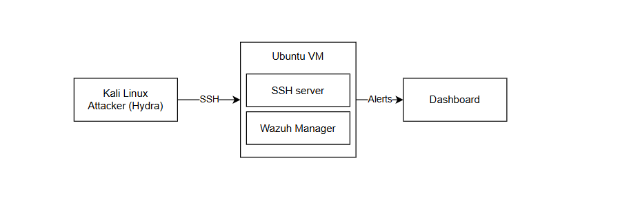
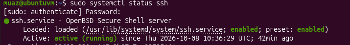
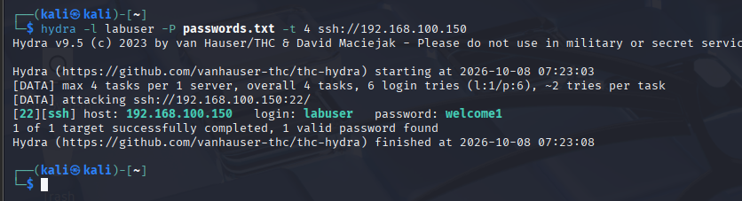
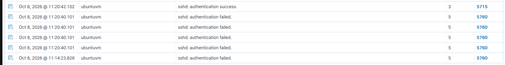
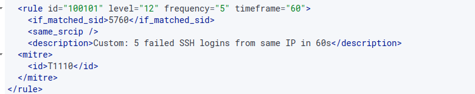
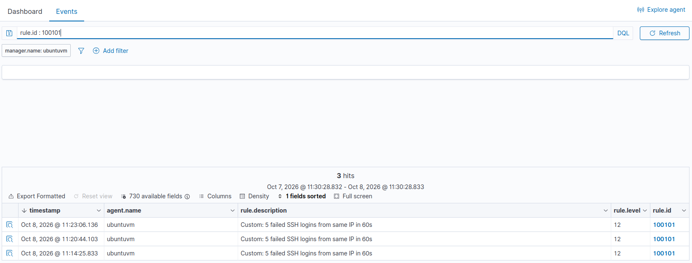

# SSH Brute-Force Detection with Wazuh

A home-lab project demonstrating how to detect SSH brute-force attacks using Wazuh SIEM, going beyond default rule alerting to a custom correlation rule.

## Overview

Wazuh ships with default rules that flag individual failed SSH logins, but a single failed login isn't an attack — it's noise. This project builds a custom correlation rule that distinguishes a real brute-force attempt (many failures from the same source in a short window) from normal login mistakes, and verifies it end-to-end with a live attack.

## Lab Environment

- **Wazuh Manager** — Ubuntu VM, monitoring its own system logs (`auth.log`)
- **Target** — the same Ubuntu VM, running OpenSSH server with a test account
- **Attacker** — Kali Linux VM, running Hydra to brute-force the SSH login
- All three VMs on the same internal network (VirtualBox)

## What Was Done

1. Installed and enabled SSH on the Ubuntu target, and created a test user account.
2. Launched a brute-force attack from Kali using Hydra against the SSH service, with a custom password wordlist.
3. Verified Wazuh's default rules caught individual events — failed login attempts and the eventual successful login.
4. Identified a gap: the defaults log *each* event but don't flag the *pattern* of repeated failures as a single, higher-severity finding.
5. Wrote a custom correlation rule that triggers when 5 or more failed SSH logins occur from the same source IP within 60 seconds, mapped to the MITRE ATT&CK technique for brute force (T1110).
6. Re-ran the attack and confirmed the custom rule fired correctly in the Wazuh dashboard, alongside the underlying individual events.

## Walkthrough

**Lab topology**

Kali attacks the Ubuntu VM over SSH. Wazuh runs as both the manager and the target on that same Ubuntu box, monitoring its own `auth.log` and surfacing alerts on the dashboard.

**SSH target live**

OpenSSH running and active on the Ubuntu VM, ready to be attacked.

**Brute-force attack**

Hydra running a wordlist against the `labuser` account over SSH, cracking the password `welcome1` on the final attempt.

**Default Wazuh detection**

Wazuh's built-in rules caught each individual event — five `5760` (failed login) alerts followed by one `5715` (successful login) — but logged them as separate, low-severity events rather than a single attack.

**Custom correlation rule**

A rule added to `local_rules.xml` that fires when 5+ failed logins hit from the same source IP within 60 seconds, tagged to MITRE ATT&CK T1110 (Brute Force).

**Custom rule firing**

The custom rule (ID 100101) triggering at severity level 12, correctly correlating the failed-login burst into one high-severity brute-force alert.

## Key Takeaway

Default SIEM rules are a starting point, not a finished detection strategy. Real brute-force detection depends on correlating multiple low-severity events into one meaningful, higher-severity alert — which is what distinguishes a usable SOC detection from raw log noise.

## Possible Extensions

- Auto-block the attacking IP when the custom rule fires (active response)
- Extend the same detection logic to RDP on the Windows endpoint
- Forward high-severity alerts to Slack/email for real-time notification
