# Web Application Firewall Home Lab: SafeLine WAF vs SQL Injection

In this project I built a website that is deliberately full of security holes, attacked it with SQL injection from Kali Linux, then put a web application firewall (**SafeLine WAF**) in front of it and showed the same attack getting blocked.

## How it works

```
Kali (attacker)  --HTTPS-->  SafeLine WAF  -->  Apache + DVWA website  -->  MySQL database
192.168.100.151              (checks traffic)     Ubuntu 192.168.100.150
```

All traffic goes through the firewall first. The firewall inspects every request, blocks the dangerous ones, and passes the safe ones to the website. The real website sits behind it on a hidden port (8080).

## The lab setup

|What I used|

|Virtualization|VMware Workstation, with both machines on the same network|
|Attacker machine|Kali Linux|
|Target machine|Ubuntu (4 GB RAM, 2 CPUs, 60 GB disk)|
|Vulnerable website|DVWA (Damn Vulnerable Web Application)|
|Firewall|SafeLine WAF (free edition, runs in Docker)|
|Website name|`dvwa.local`|

**Ubuntu IP**

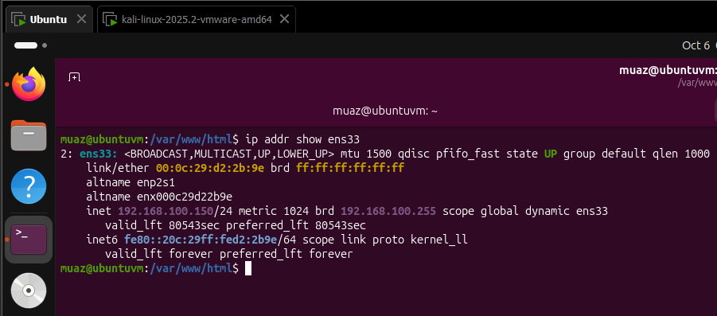

**Kali IP**

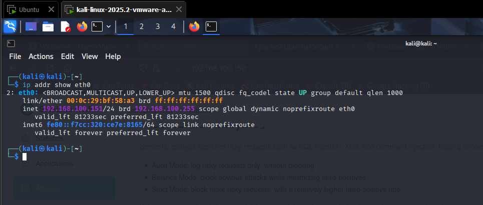

## Step 1: Build the vulnerable website

I set up two virtual machines, Kali (the attacker) and Ubuntu (the target). On Ubuntu I installed a web server (Apache), PHP, and a database (MySQL). Then I downloaded DVWA, a practice website made to be hacked, and connected it to its own database. I finished the setup from the browser by clicking "Create / Reset Database".

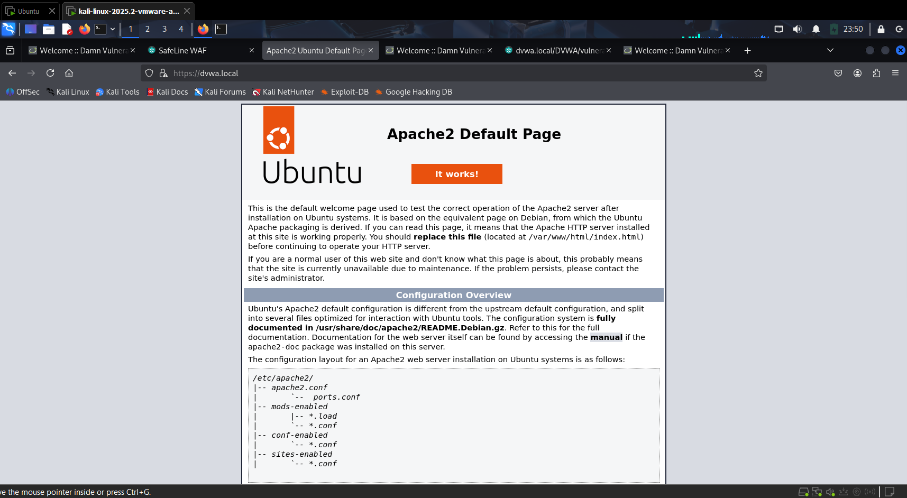
*The web server is running and reachable from Kali.*

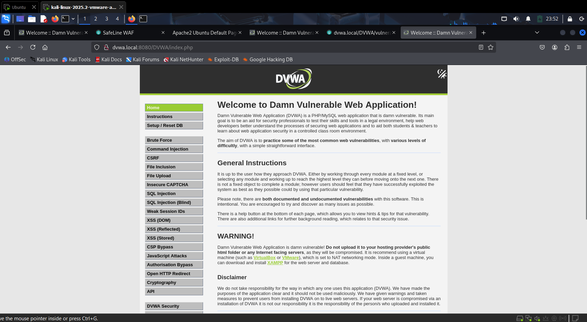
*DVWA setup page. The red items only affect exercises I didn't use.*

## Step 2: Attack the website with no firewall

SQL injection works when a website pastes what you type straight into a database question. By typing a trick input (`1' OR '1'='1`) into the User ID box, the question becomes "give me every user whose ID is 1 OR true". Since "true" is always true, the database hands over **all** the users.

I set DVWA's security level to Low and ran the attack. It worked.

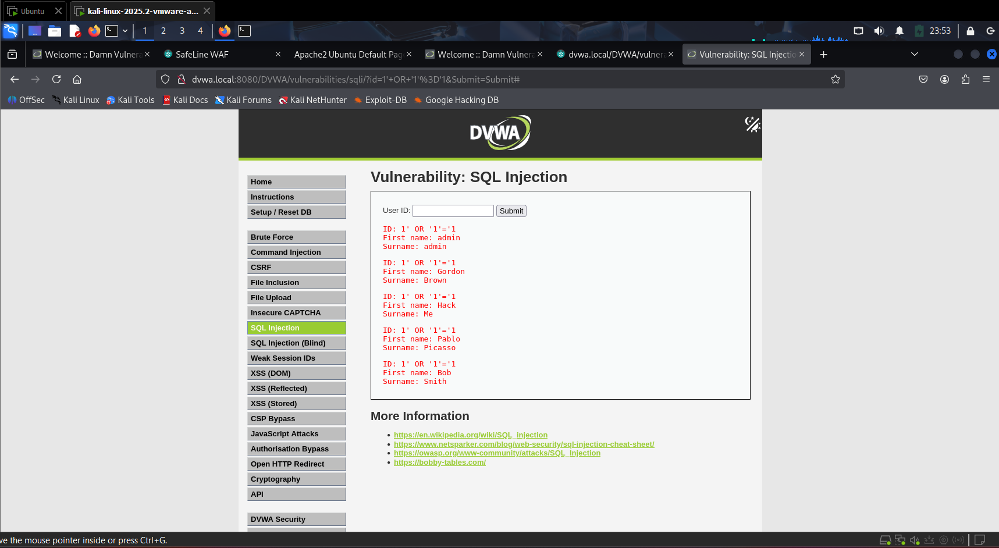
*Before the firewall: every user is listed.*

## Step 3: Put the firewall in front

1. **Moved the website out of the way.** I changed Apache from port 80 to port 8080, so the firewall could take the normal web ports.
2. **Gave the site a name.** I mapped `dvwa.local` to the Ubuntu machine's IP on both VMs, so no DNS server was needed.
3. **Made an HTTPS certificate.** I created a self-signed certificate so the firewall could serve the site over HTTPS. Browsers show a warning for it, which is fine in a lab.
4. **Installed SafeLine.** I ran SafeLine's official installer, which sets it up in Docker containers and gives you an admin login for its control panel.

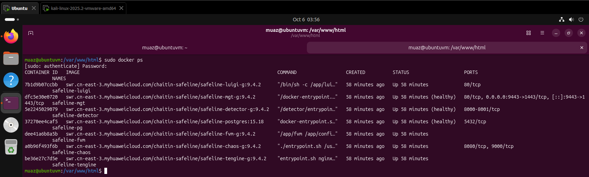
*All SafeLine containers are running.*

5. **Uploaded the certificate** in the SafeLine panel.
6. **Added the website as a protected application.** I told SafeLine to listen for `dvwa.local` on HTTPS (port 443) and to forward clean traffic to the real website on port 8080. This setup is called a **reverse proxy**.

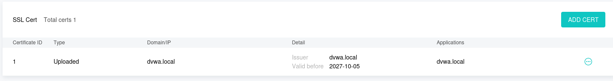
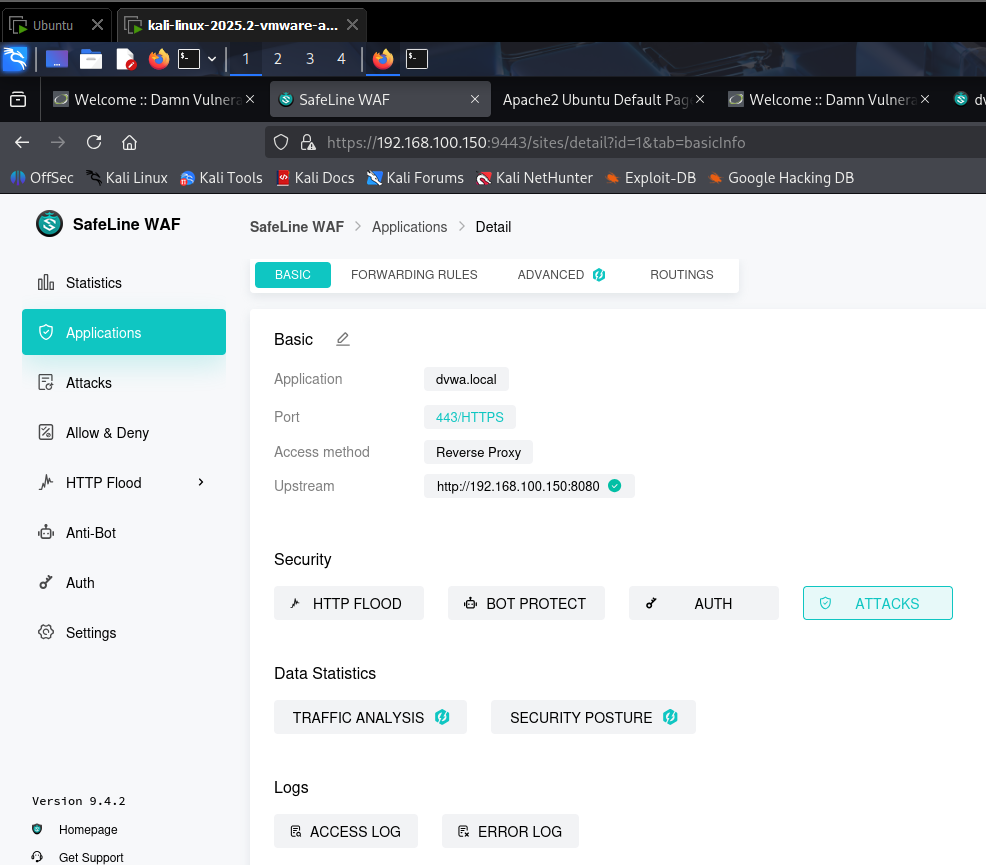
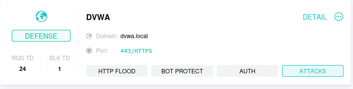

## Step 4: Attack again, with the firewall on

I visited the site through the firewall (`https://dvwa.local`) and typed the same attack. This time SafeLine stopped it and showed an "Access Forbidden" page. The website never saw the request.

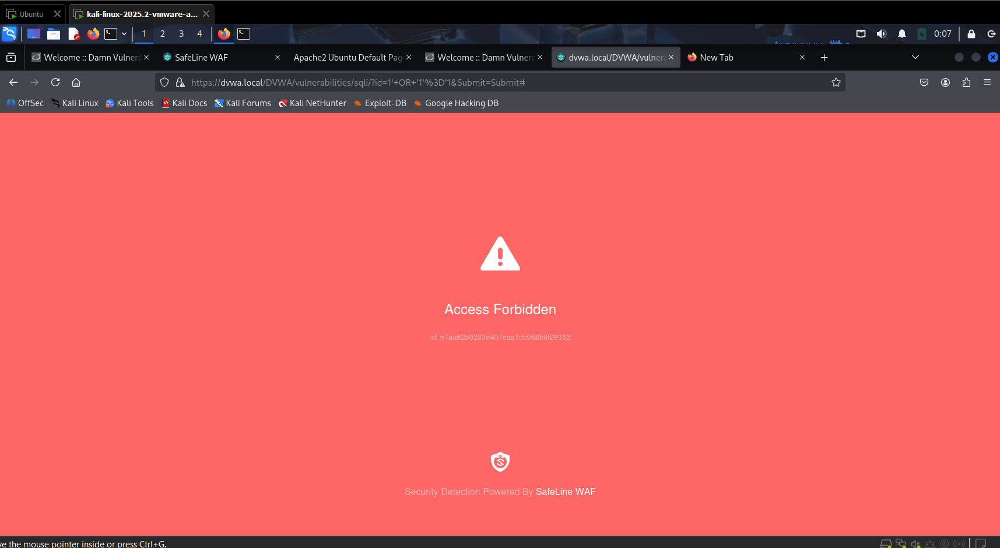
*After the firewall: the attack is blocked.*

SafeLine also logged the attack. The log shows that it was blocked, that it was SQL injection, which machine sent it, and the exact text that gave it away. Normal requests, like looking up user 1, still worked.

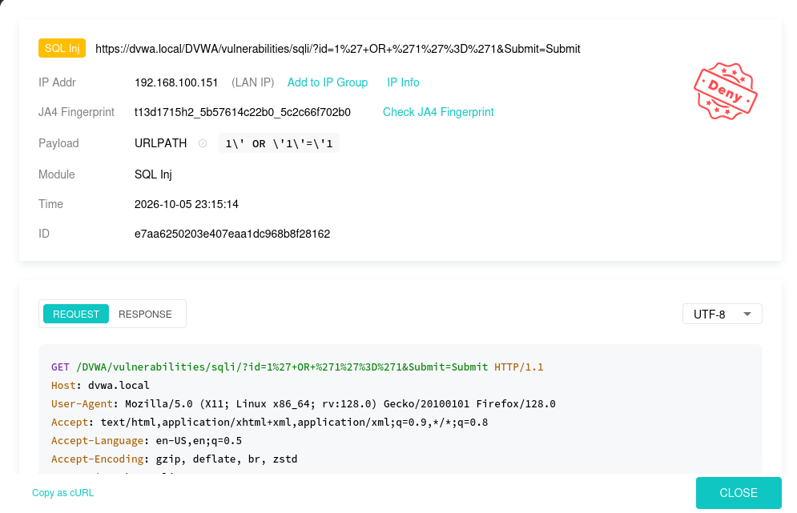

## Problems I ran into

|Problem|What was wrong|How I fixed it|
|-|-|-|
|Updates failed|The virtual disk was full|Made the disk bigger in VMware and extended the partition|
|Docker wouldn't install|Ubuntu still listed the old install CD as a software source|Disabled that source|
|Firewall wouldn't install|Another tool (Wazuh) was using the web port and most of the memory|Stopped it for the lab|
|Attack wasn't blocked|I was visiting port 8080, which skips the firewall|Used `https://dvwa.local` instead|

## What I learned

* A web application firewall protects a website **without changing the website's code**.
* It only works if **all traffic goes through it**. Visiting the backend directly bypasses it.
* SafeLine recognised the *purpose* of the request, not just a keyword.
* Vulnerable labs must stay **isolated** from real networks.
